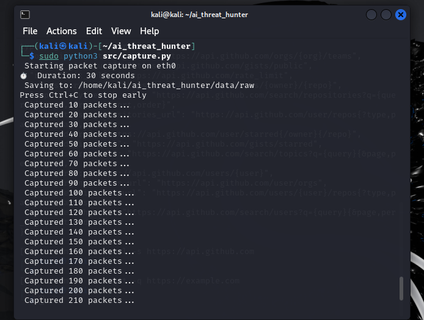
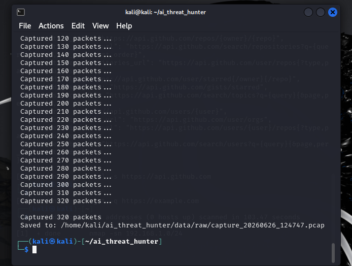
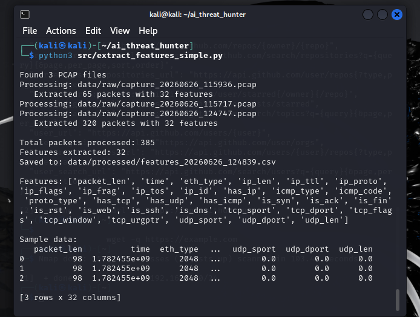
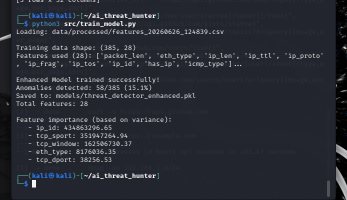
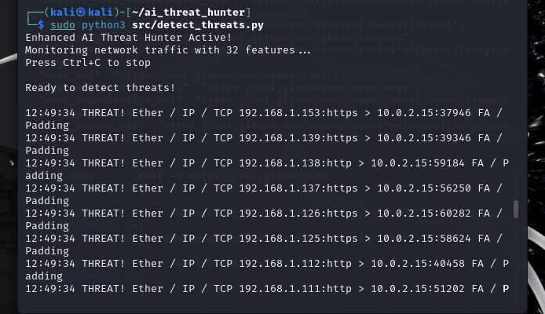
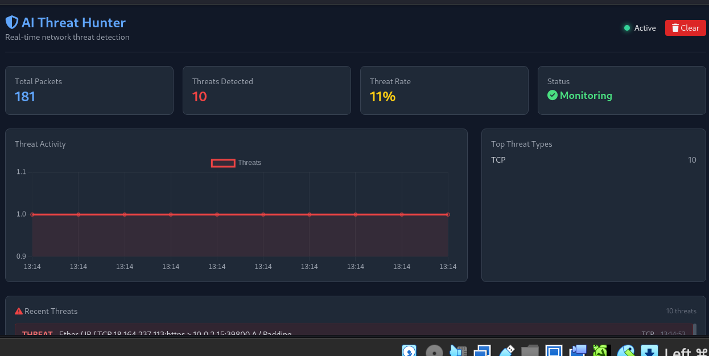
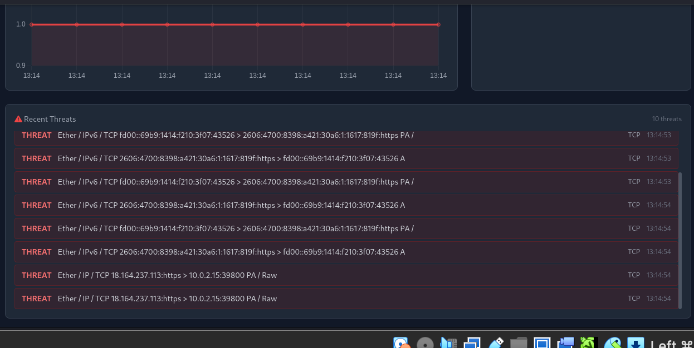

 AI-Powered Network Threat Hunter

[](https://www.python.org/)
[](https://flask.palletsprojects.com/)
[](LICENSE)
[](http://makeapullrequest.com)

> A real-time network threat detection system using Machine Learning (Isolation Forest) to identify anomalies in network traffic with a professional dashboard.

---

## Overview

Modern networks face constant security threats. This project demonstrates how Machine Learning can be used to detect anomalies in network traffic in real-time. The system captures live network packets, extracts 32+ features, and uses an Isolation Forest model to identify suspicious activity.

**What it does:**
- Captures live network packets
- Extracts 32+ features from each packet
- Trains an ML model to learn normal traffic patterns
- Detects anomalies and threats in real-time
- Visualizes threats on a live dashboard

---

## Features

| Category | Features |
|----------|----------|
| **Packet Capture** | Real-time network packet capture using Scapy |
| **Feature Extraction** | 32+ features extracted from each packet |
| **Machine Learning** | Isolation Forest model trained on network traffic |
| **Real-time Detection** | Live threat detection with instant alerts |
| **Dashboard** | Flask-based web dashboard with WebSocket updates |
| **Threat Visualization** | Real-time charts, statistics, and threat types |

---

## Tech Stack

| Component | Technology |
|-----------|------------|
| **Network Capture** | Scapy, SocketCAN |
| **Data Processing** | Pandas, NumPy |
| **Machine Learning** | Scikit-learn (Isolation Forest) |
| **Backend** | Flask, Flask-SocketIO |
| **Frontend** | HTML, CSS, JavaScript, Chart.js |
| **Real-time** | WebSockets, Socket.IO |
| **OS** | Kali Linux / Ubuntu |

---

## Screenshots

### Packet Capture
*Capturing live network traffic in real-time*



---

### Packet Capture Progress
*320+ packets captured and saved to PCAP file*



---

### Feature Extraction
*Extracting 32 features from 385 packets*



---

### ML Model Training
*Isolation Forest model trained with 58/385 anomalies detected (15.1%)*



---

### Real-time Threat Detection
*Live threats being detected and alerted*



---

### Live Dashboard
*Professional dashboard showing threats in real-time*




---

## Installation

### Prerequisites

```bash
# Update system
sudo apt update

# Install CAN utilities (if needed)
sudo apt install can-utils -y
Clone Repository
bash
git clone https://github.com/kanika021105/ai-threat-hunter.git
cd ai-threat-hunter
Install Python Dependencies
bash
pip3 install -r requirements.txt
Quick Start
1. Capture Network Traffic
bash
sudo python3 src/capture.py
This will:

Capture packets for 30 seconds

Save to data/raw/ as PCAP file

2. Extract Features
bash
python3 src/extract_features_simple.py
This will:

Read PCAP files

Extract 32 features from each packet

Save to data/processed/ as CSV

3. Train ML Model
bash
python3 src/train_model.py
This will:

Load feature data

Train Isolation Forest model

Save model to models/ directory

4. Run Real-time Detection
bash
sudo python3 src/detect_threats.py
This will:

Monitor live network traffic

Analyze each packet with ML model

Alert when threats are detected

5. Launch Dashboard
bash
sudo python3 dashboard/app.py
Open in browser:

text
http://localhost:5000
Dashboard Features
Feature	Description
Total Packets	Real-time packet count
Threats Detected	Number of anomalies found
Threat Rate	Percentage of threats
Status	Monitoring / Protected
Threat Chart	Real-time threat timeline
Threat Types	Top protocols detected
Recent Threats	List of latest threats
Project Structure
text
ai_threat_hunter/
├── data/
│   ├── raw/              # PCAP files
│   └── processed/        # CSV feature files
├── models/               # Trained ML models
├── src/
│   ├── capture.py                     # Packet capture
│   ├── extract_features_simple.py     # Feature extraction
│   ├── train_model.py                 # Train ML model
│   └── detect_threats.py              # Real-time detection
├── dashboard/
│   ├── app.py                         # Flask backend
│   └── templates/
│       └── dashboard.html             # Web dashboard
├── images/                # Screenshots
├── requirements.txt       # Python dependencies
├── README.md             # This file
└── LICENSE               # MIT License
How It Works
1. Packet Capture
Using Scapy, the system captures live network packets on the specified interface.

2. Feature Extraction
Each packet is analyzed to extract 32 features:

Packet length, Ethernet type

IP layer: length, TTL, protocol, flags, fragmentation

TCP/UDP/ICMP specific fields

Derived features: SYN flags, service detection, protocol types

3. Model Training
Isolation Forest algorithm is trained on normal traffic to learn patterns and detect anomalies.

4. Real-time Detection
New packets are scored by the trained model. Packets that deviate from normal patterns are flagged as threats.

5. Dashboard Visualization
Threats are displayed on a live dashboard with charts and alerts.

Model Performance
Metric	Value
Training Data	385 packets
Features	32
Algorithm	Isolation Forest
Anomalies Detected	58/385 (15.1%)
Top Features	ip_id, tcp_sport, tcp_window, eth_type, tcp_dport
Security Considerations
IMPORTANT: This tool is for educational and research purposes only!

Always test in controlled environments

Get proper authorization before testing on production networks

Follow responsible disclosure practices

Never use on networks you don't own or have permission to test

Future Enhancements
Advanced ML Models: Random Forest, XGBoost for better accuracy

More Features: Payload analysis, flow statistics

Alerts: Email/Slack notifications

Database: Store historical threats for analysis

Multi-interface: Monitor multiple network interfaces

Deployment: Docker containerization

Contributing
Contributions are welcome! Here's how:

Fork the repository

Create your feature branch: git checkout -b feature/amazing-feature

Commit your changes: git commit -m 'Add amazing feature'

Push: git push origin feature/amazing-feature

Open a Pull Request

